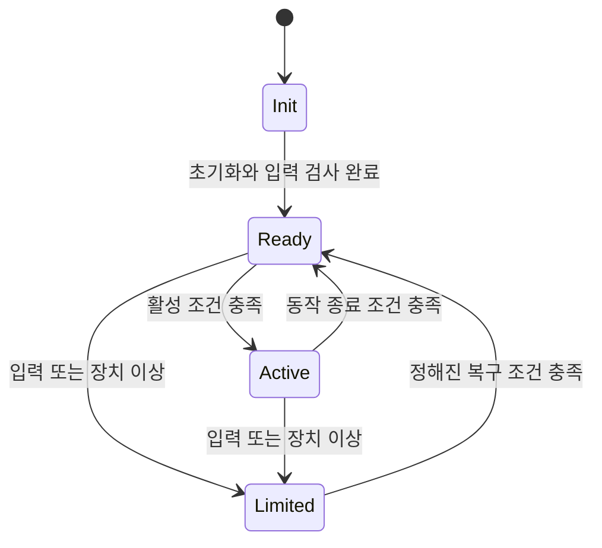

# Automotive Embedded SW

신호 처리, 실시간 실행과 제어기 간 협조

[상세 개념](./README.md) · [시스템 구성도](./Visual_Overview.md)

자동차 임베디드 소프트웨어는 센서와 통신에서 얻은 정보를 이용해 차량 상태를 판단하고, 정해진 시간 안에 제어 출력을 만든다. 이 문서는 물리량이 소프트웨어 데이터가 되고 다시 실제 동작으로 이어지는 구조를 정리한다.

## 1. 제어 루프와 데이터의 의미

`입력 수집 → 유효성 확인 → 상태 추정 → 제어 연산 → 출력 적용 → 동작 결과 측정`

입력은 측정값과 상태 정보를 함께 포함한다. ADC 원시값을 전압·온도로 환산하거나 타이머로 측정한 펄스 간격을 회전속도로 바꾼 뒤, 범위와 갱신 시각을 확인한다. 필터는 잡음을 줄이지만 지연을 추가하므로 신호 품질과 응답성 사이의 관계를 고려한다.

상태 추정은 센서 하나로 직접 얻기 어려운 차속이나 배터리 충전 상태 등을 여러 관측으로 계산하는 과정이다. 제어기는 목표와 추정 상태의 차이를 바탕으로 명령을 만들고, 액추에이터의 동작 범위와 시스템 제한에 맞추어 출력을 적용한다.

## 2. 기능별 입력과 출력

| 기능 | 주요 입력 | 계산·판단 | 출력 |
|---|---|---|---|
| ABS | 휠 속도 | 바퀴 감속과 슬립에 따른 잠김 경향 | 유압 모듈레이터 명령 |
| TCS | 휠 속도·구동 요구 | 과도한 구동륜 슬립 | 구동 토크 감소·제동 요청 |
| ESC / VDC | 조향각·휠 속도·요레이트·횡가속도 | 의도한 운동과 실제 운동의 차이 | 개별 바퀴 제동·토크 조절 |
| EPS | 조향 토크·차속 등 | 필요한 보조력 | 모터 보조 토크 |
| AFS | 차속·조향 상태 등 | 유효 조향비 또는 추가 조향각 | 조향 액추에이터 명령 |
| ACC / ASCC | 선행차 거리·상대속도·자차 상태 | 목표 속도·차간거리와의 차이 | 가감속 요청 |
| LKAS | 주로 카메라 기반 차선 정보·자차 상태 | 차선과 차량의 상대 위치 | 조향 요청 |
| AEB | 물체 관측·상대운동·자차 상태 | 충돌 위험 | 제동 요청 |
| EV 구동 | 페달·모터·배터리 상태 | 요구 토크와 허용 범위 | 인버터·모터 토크 명령 |

이 표는 논리적 기능 관계다. ABS·TCS·ESC가 각각 별도 ECU라는 뜻은 아니며, ADAS의 센서 구성과 출력 인터페이스도 구현에 따라 달라진다.

## 3. 상태기계와 동작 모드

상태기계는 제어 기능이 언제 사용 가능하고 어떤 출력을 허용하는지 명시한다. 연속적인 토크 계산과 별도로 초기화, 정상 동작, 제한 동작, 고장 처리 같은 이산적인 모드를 관리한다.

위 그림은 일반적인 모드 관리 예시이며 특정 제동 기능의 양산 사양이 아니다. 상태 전환에는 임계값뿐 아니라 조건 유지 시간, 히스테리시스, 입력 유효성, 고장 상태가 함께 사용된다. 히스테리시스는 진입·해제 기준을 다르게 두어 경계 부근에서 모드가 반복 전환되는 현상을 줄인다.

## 4. 실시간 실행 구조

센서 수집, 제어 계산, 통신과 진단은 요구 주기가 다르다. 실제 ECU는 주기 태스크와 이벤트 처리 등을 조합하며, 인터럽트는 시간에 민감한 이벤트를 포착하는 데 사용한다. 오래 걸리는 처리는 후속 태스크로 넘겨 다른 작업의 지연을 관리할 수 있다.

| 개념 | 의미 | 제어와의 관계 |
|---|---|---|
| 샘플링 주기 | 센서 데이터를 얻는 간격 | 너무 길면 빠른 변화를 놓치며, 샘플링과 필터 조건이 신호 해석에 영향을 준다. |
| 실행 주기·지터 | 태스크 간격과 그 변동 | 제어기가 가정한 시간 간격과 실제 실행 간격의 차이가 응답에 영향을 준다. |
| WCET | 최악 조건의 실행시간 상한 | 우선순위와 다른 작업의 간섭을 포함해 마감시간 충족 여부를 판단하는 근거다. |
| 인터럽트 지연 | 이벤트 발생부터 처리 시작까지의 시간 | 타임스탬프와 빠른 입력 대응에 영향을 준다. |
| End-to-end 지연 | 측정부터 출력 적용까지의 전체 시간 | 센서·태스크·통신·출력 단계의 지연이 누적된다. |
| Timeout | 일정 시간 새 입력이 없는 상태 | 오래된 값을 정상적인 현재 값으로 사용하는 일을 막는다. |
| 출력 포화 | 장치가 명령 범위를 더 이상 따라갈 수 없는 상태 | 명령 제한과 제어기의 내부 상태 처리가 필요하다. |

주기는 기능의 동특성과 마감시간에서 정한다. 모든 센서·제어·통신을 동일한 주기의 단일 루프에 넣는 것으로 실시간성이 보장되지는 않는다.

## 5. ECU 통신과 데이터 계약

다른 ECU에서 받은 값도 로컬 센서처럼 의미와 유효성을 확인해야 한다. 예를 들어 휠 속도 메시지는 물리 단위, 스케일, 바퀴별 배치, 갱신 주기와 오류 표현이 송수신 측에서 일치해야 사용할 수 있다.

| 항목 | 역할 |
|---|---|
| 메시지 ID | 메시지를 식별한다. CAN에서는 중재 우선순위에도 관여한다. |
| 신호 인코딩 | 비트 위치·바이트 순서·부호·배율·오프셋을 정의해 원시값을 물리량으로 바꾼다. |
| 주기·갱신 시각 | 값이 얼마나 최근에 관측·전달되었는지 판단한다. |
| Timeout·유효 상태 | 미수신·센서 오류·사용 불가 상태를 구분한다. |
| Alive counter | 애플리케이션 메시지의 반복이나 누락 탐지에 활용한다. 카운터 크기와 허용 규칙이 필요하다. |
| CRC / E2E 보호 | 통신 오류를 탐지한다. CAN 프레임 CRC와 애플리케이션 계층의 종단 간 보호는 범위가 다르다. |

Alive counter와 추가 CRC는 모든 메시지에 자동으로 포함되는 정보가 아니다. 시스템의 통신 사양에 따라 정의된다. 메시지를 받았다는 사실만으로 데이터의 최신성이나 센서 자체의 정상 상태가 보장되지는 않는다.

## 6. 진단과 제한 동작

진단은 통신 단절, 센서 범위 이탈, 신호 간 불일치, 액추에이터 응답 이상 등을 관찰한다. 순간적인 잡음과 지속 고장을 구분하기 위해 시간 조건이나 발생 횟수를 사용할 수 있다. 고장 검출 결과는 기록과 알림뿐 아니라 출력 허용 범위와 모드 전환에도 영향을 준다.

**워치독**은 정해진 감시 조건을 만족하지 못하는 실행 이상을 탐지하는 수단이다. 모든 논리 오류를 검출하는 장치는 아니므로 입력 진단과 동작 감시 등을 함께 구성한다. **Fail-safe**의 구체적인 출력과 복구 방식은 기능에 따라 다르며, 모든 장치를 단순히 끄는 동작으로 통일할 수 없다.

## 7. 전기차 제어기의 협조

운전자의 페달 입력은 요구 토크 또는 감속 요구로 해석된다. VCU는 BMS의 가용 전력, 모터·인버터의 온도와 동작 범위, 제동 시스템의 요청 등을 종합해 구동계를 조율한다. 모터 제어기는 최종 명령에 맞추어 전류를 조절한다.

| 구성 | 소프트웨어의 주요 역할 |
|---|---|
| BMS | 셀 전압·온도·팩 전류 감시, SOC 등의 상태 추정, 허용 충방전 범위와 보호 상태 관리 |
| VCU | 운전자 요구 해석, 제한 조건 통합, 구동·회생 요구 조정 |
| 모터 제어기 | 토크 요청 수신, 회전자 위치·전류 처리, 전력 스위칭 제어 |
| 제동 제어기 | 요구 감속과 안정성 조건을 반영한 회생·마찰제동 협조 |

회생제동에서는 발전 토크를 요청해도 배터리가 그 전력을 수용할 수 있어야 한다. 따라서 회생 가능량은 고정값이 아니며 가용 전력과 차량 상태의 변화가 제동 배분에 반영된다.

이 문서의 **모터 제어기(Motor Control Unit)**와 칩을 뜻하는 **마이크로컨트롤러(Microcontroller Unit)**는 같은 MCU 약어를 사용하므로 표기 문맥을 구분한다.

## 8. ADAS의 데이터 처리

카메라 영상과 레이더 관측은 갱신 시각과 좌표계가 다를 수 있다. 센서 융합은 시간·공간 관계를 맞추고, 객체의 위치·속도·불확실성을 일관되게 표현하는 과정이다. 과거 시점의 관측을 현재 상태로 잘못 해석하면 판단 오차가 생긴다.

인지와 추적은 차선·물체 상태를 제공하고, 상황 평가는 충돌 가능성과 주행 제약을 해석한다. 계획은 목표 경로·속도를 만들며, 차량 제어는 이를 조향·가감속 요청으로 변환한다. 수신 측 제어기는 자체의 장치 제한과 유효성 조건을 함께 적용한다.

## 9. 하드웨어 인터페이스와 소프트웨어

| 인터페이스·장치 | 소프트웨어 처리 |
|---|---|
| GPIO | 스위치 상태 등 디지털 입출력과 디바운스 처리 |
| ADC | 아날로그 신호 샘플링과 물리량 환산 |
| Timer / Input Capture | 펄스 주기·폭 측정과 회전속도 계산 |
| SPI / I²C | 센서·주변 IC의 레지스터와 측정 데이터 교환 |
| PWM / Driver | 듀티·주파수 등의 명령을 전력단으로 전달 |
| CAN Controller | 프레임 송수신과 오류 상태 제공, 태스크·큐와 연계 |
| RTOS / Scheduler | 태스크 실행 순서, 주기와 공유 자원 관리 |

PWM은 그 자체로 토크값이 아니며, 실제 출력은 전원·모터·드라이버와 제어 방식에 따라 달라진다. 소프트웨어의 신호값과 실제 물리적 동작 사이에는 항상 장치 특성과 인터페이스 정의가 존재한다.
