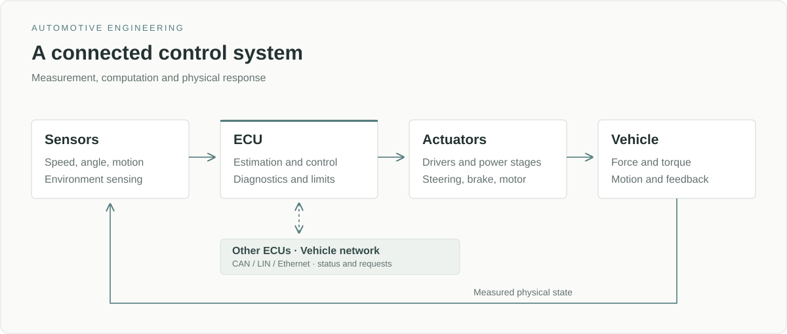
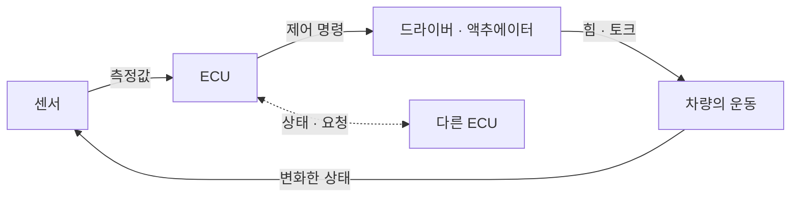
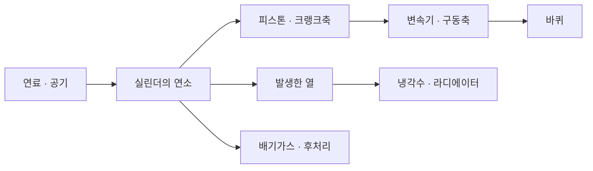
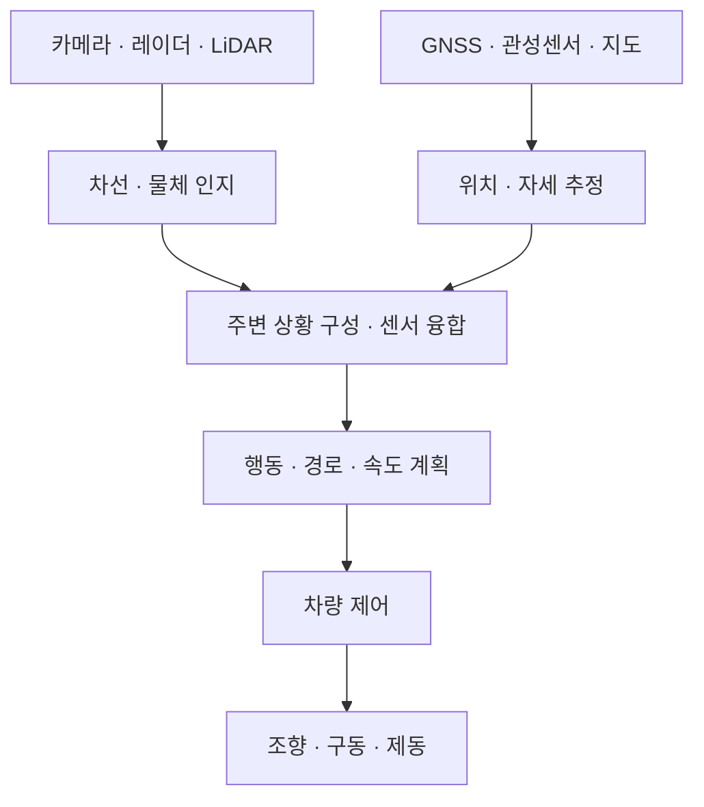

# Automotive Engineering

시스템 구성과 작동 흐름

[상세 개념](./README.md) · [임베디드 SW 구조](./Embedded_SW_Study_Guide.md)

자동차는 에너지를 운동으로 바꾸는 기계 시스템과, 그 운동을 측정하고 조절하는 전자제어 시스템으로 구성된다. 아래 도식은 기능 사이의 관계를 나타낸 개념도이며, 실제 ECU의 개수나 배선을 뜻하지 않는다.

## 01 · 차량을 구성하는 세 영역

| 영역 | 구성 | 역할 |
|---|---|---|
| **구조와 운동** | 차체·동력전달·현가·조향·제동 | 하중을 지지하고 바퀴에 힘을 전달하며 차량의 움직임을 결정한다. |
| **에너지** | 엔진·연료·윤활·냉각 / 배터리·인버터·모터 | 주행에 필요한 에너지를 공급·변환하고 열과 손실을 관리한다. |
| **측정과 제어** | 센서·ECU·차량 네트워크·액추에이터 | 상태를 측정하고 목표에 맞는 명령을 계산해 장치를 조율한다. |

세 영역은 독립적으로 동작하지 않는다. 가속 요구는 구동 토크로 바뀌지만 실제 가속도는 차량 질량과 저항에 영향을 받으며, 접지력이 부족하면 자세제어가 토크를 제한한다.

## 02 · 측정에서 실제 동작까지

ECU는 센서값을 그대로 출력으로 바꾸는 장치가 아니다. 신호의 유효성을 확인하고 차량 상태를 추정한 뒤, 목표와 실제 상태의 차이에 따라 출력을 계산한다. 액추에이터가 만든 변화가 다시 측정되는 과정이 **피드백 루프**다.

실선은 제어 루프의 흐름, 점선은 네트워크를 통한 ECU 간 정보 교환을 나타낸다. 같은 ECU가 직접 구동하는 액추에이터는 CAN이나 LIN을 거치지 않을 수도 있다.

## 03 · 섀시 제어의 역할 분담

| 시스템 | 작동 상황 | 제어하는 것 |
|---|---|---|
| **ABS** | 제동 중 바퀴가 잠기려 할 때 | 제동압을 조절해 바퀴 잠김을 억제한다. |
| **TCS** | 가속 중 구동륜이 과도하게 헛돌 때 | 구동 토크와 바퀴 제동을 조절해 슬립을 줄인다. |
| **ESC / VDC** | 의도한 선회와 실제 차량 운동이 다를 때 | 개별 바퀴 제동과 구동 토크로 차체의 회전 거동을 보정한다. |
| **EPS** | 운전자가 조향할 때 | 조향 토크·차속 등에 맞추어 전동기 보조력을 조절한다. |
| **AFS** | 주행 조건에 맞는 조향 반응이 필요할 때 | 조향 입력과 바퀴 조향각의 관계를 능동적으로 바꾼다. |

ABS와 TCS가 주로 바퀴의 슬립을 다루는 반면, ESC는 조향각과 요레이트 등을 함께 사용해 차량 전체의 움직임을 다룬다. 이 기능들은 센서와 유압 장치를 공유하거나 하나의 제어기에 통합될 수 있다. [작동 원리: Bosch ESP](https://www.bosch-mobility.com/en/solutions/driving-safety/electronic-stability-program/)

## 04 · 내연기관의 에너지와 유체

4행정은 **흡입 → 압축 → 동력 → 배기**로 반복된다. 연소로 얻은 에너지 일부가 크랭크축의 일로 바뀌고, 나머지는 배기와 냉각 등으로 빠져나간다. 엔진 제어는 분사량과 점화 시점 등을 조절해 요구 출력과 운전 상태에 대응한다.

| 보조 계통 | 대표 흐름 | 의미 |
|---|---|---|
| 윤활 | 오일 팬 → 펌프·필터 → 마찰부 → 오일 팬 | 유막을 만들고 열과 이물질을 운반한다. |
| 냉각 | 펌프 → 워터재킷 → 라디에이터 → 펌프 | 열을 공기로 내보낸다. 냉간에는 라디에이터 흐름을 제한하고 바이패스 순환으로 예열을 돕는다. |
| 연료 | 탱크 → 펌프·필터 → 인젝터 | 필요한 연료를 공급한다. 분사 위치와 고압계 구성은 엔진 형식에 따라 다르다. |

## 05 · 전기차의 전력과 제어 신호

**실선은 에너지 전달**, **점선은 측정·제어 정보**다. 가속할 때는 배터리에서 바퀴로 에너지가 흐르고, 회생제동할 때는 반대로 흐른다. BMS는 배터리 상태와 허용 범위를 관리하고, VCU는 이를 운전자 요구와 함께 고려해 구동계를 조율한다.

| 장치 | 구분 |
|---|---|
| **BMS** | 배터리를 감시·보호하는 제어 시스템이다. 구동 전력의 변환 단계가 아니다. |
| **인버터** | 전력을 변환하고 모터 전류를 제어하여 요구 토크를 구현한다. |
| **OBC** | 외부 AC 전원을 배터리 충전용 DC로 변환한다. |
| **LDC** | 고전압을 저전압으로 변환해 보조 전장에 공급한다. |

회생 가능한 제동력은 배터리와 구동계 상태에 따라 제한된다. 부족한 부분은 마찰제동과 조합하며, 실제 제동 배분은 요구 감속과 안정성 조건을 함께 반영한다. [회생·마찰제동의 협조: Bosch](https://www.bosch-mobility.com/en/solutions/driving-safety/regenerative-braking-systems/)

## 06 · ECU가 공유하는 정보

| 정보 제공 측 | 공유 정보 | 활용 측의 동작 |
|---|---|---|
| 제동 제어기 | 휠 속도·제동 상태 | 다른 제어기와 계기판에서 속도 및 상태 판단에 활용한다. |
| ESC | 토크 감소 요청 | 엔진·모터 제어기가 구동 토크를 조절한다. |
| BMS | 배터리 상태·허용 충방전 전력 | VCU가 구동과 회생 요구를 제한 범위에 맞춘다. |
| ADAS 제어기 | 목표 가속도·조향 요청 등 | 구동·제동·조향 제어기가 요청과 자체 제한 조건을 함께 처리한다. |

CAN·LIN·차량용 Ethernet은 차내 장치 간 정보를 전달한다. 차량은 여러 네트워크와 게이트웨이로 구성될 수 있으며, **V2X는 차량 외부와의 통신**을 뜻한다. 수신 데이터는 값뿐 아니라 갱신 시각과 유효 상태도 함께 해석해야 한다.

## 07 · ADAS의 처리 흐름

인지 결과는 주변 환경에 대한 관측이고, 계획 결과는 차량이 따라야 할 목표다. 제어기는 그 목표를 조향과 토크 등의 명령으로 바꾼다. 모든 ADAS가 위 센서를 전부 사용하거나 모든 처리 단계를 별도 모듈로 구현하는 것은 아니다.

**ACC / ASCC**는 속도와 차간거리를, **LKAS**는 차선 유지를 보조한다. **LDWS**는 이탈 경고, **AEB**는 충돌 위험 시 자동 제동을 담당한다. LKAS의 차선 정보는 주로 카메라에서 얻는다. [카메라 기반 기능: Bosch](https://www.bosch-mobility.com/en/solutions/camera/multi-purpose-camera/)

## 08 · 서로 다른 범주의 용어

| 용어 | 다루는 범위 |
|---|---|
| **xEV** | HEV·PHEV·BEV·FCEV 등 전동화 동력계의 구분 |
| **ADAS** | 운전자의 주행 인지와 조작을 보조하는 기능 |
| **SDV** | 소프트웨어로 차량 기능을 구성하고 개선하는 시스템 접근 |
| **MBSE** | 요구사항·설계·검증 근거를 모델로 연결하는 개발 방식 |
| **AI** | 인식·예측 등에 활용되는 구현 기술 |

이 용어들은 순서대로 거치는 단계가 아니다. 하나의 차량 안에서 전동화 동력계, 운전자 보조 기능, 소프트웨어 구조와 개발 방식이 함께 적용될 수 있다.

---

[상세 개념으로 이동](./README.md) · [신호 처리·실시간 실행·진단 구조](./Embedded_SW_Study_Guide.md)
