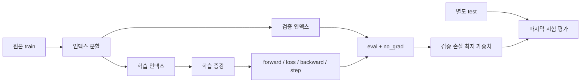
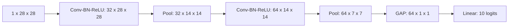
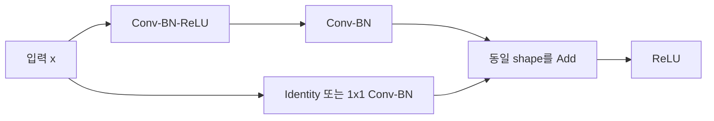
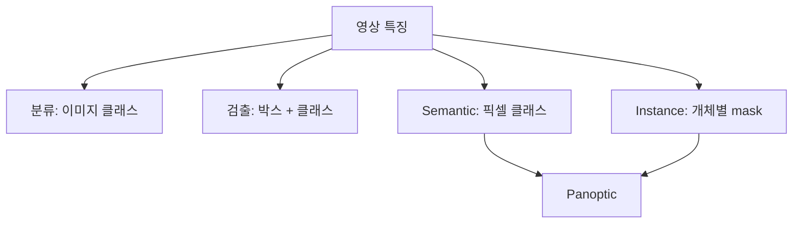

# Visual Overview

## 학습·검증·시험

```mermaid
flowchart LR
    A[원본 train] --> B[인덱스 분할]
    B --> C[학습 인덱스]
    B --> D[검증 인덱스]
    C --> E[학습 증강]
    E --> F[forward / loss / backward / step]
    D --> G[eval + no_grad]
    F --> G
    G --> H[검증 손실 최저 가중치]
    I[별도 test] --> J[마지막 시험 평가]
    H --> J
```

## CNN 예제의 텐서 흐름

```mermaid
flowchart LR
    A[1 x 28 x 28] --> B[Conv-BN-ReLU: 32 x 28 x 28]
    B --> C[Pool: 32 x 14 x 14]
    C --> D[Conv-BN-ReLU: 64 x 14 x 14]
    D --> E[Pool: 64 x 7 x 7]
    E --> F[GAP: 64 x 1 x 1]
    F --> G[Linear: 10 logits]
```

## Residual block

```mermaid
flowchart LR
    X[입력 x] --> C1[Conv-BN-ReLU]
    C1 --> C2[Conv-BN]
    X --> S[Identity 또는 1x1 Conv-BN]
    C2 --> A[동일 shape를 Add]
    S --> A
    A --> R[ReLU]
```

## 과제별 출력

```mermaid
flowchart TD
    A[영상 특징] --> B[분류: 이미지 클래스]
    A --> C[검출: 박스 + 클래스]
    A --> D[Semantic: 픽셀 클래스]
    A --> E[Instance: 개체별 mask]
    D --> F[Panoptic]
    E --> F
```
