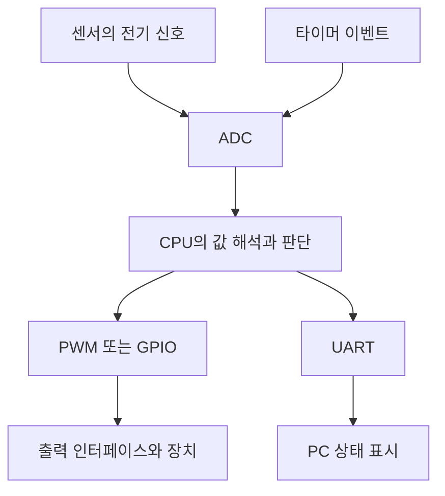

# Embedded Systems Fundamentals

컴퓨터의 실행 구조에서 출발해 MCU의 메모리, 레지스터, 주변장치와 시스템 통합을 정리한 기술 노트이다. 각 요소는 **무엇을 담당하는지**, **데이터가 어디로 이동하는지**, **소프트웨어 명령이 실제 입출력으로 어떻게 이어지는지**를 중심으로 설명한다.

[인터페이스 회로](../Embedded_System_Interface_Circuits/README.md) · [MCU 프로그래밍](../MCU_Programming/README.md) · [자동차 공학 기초](../Automotive_Engineering_Fundamentals/Fundamentals.md)

## 1. 과정 개요와 자료 구성

임베디드 시스템은 제품의 기능을 수행하도록 하드웨어와 소프트웨어를 결합한 컴퓨터 시스템이다. 이 과정은 PC에서 익숙한 CPU·메모리·입출력의 역할을 작은 MCU 안에서 다시 찾고, GPIO·ADC·타이머·통신이 현실의 입력과 출력을 연결하는 방식을 다룬다.

| 구분 | 내용 |
|---|---|
| 과정 | 현대자동차 임베디드 AI 과정 SW 트랙 |
| 자료 | 박규칠 「임베디드시스템의이해」 및 「임베디드 시스템의 이해 추가자료」 |
| 주요 대상 | ATmega128 및 교육용 보드 |
| 개발 환경 사례 | Microchip Studio 7, AVR 도구 체인, AVRISP MKII, 직렬 터미널 |

### 학습 흐름

| 구간 | 주제 | 추가자료 페이지 |
|---|---|---|
| 1일차 오전 | 제품 속 컴퓨터, CPU·메모리·버스, 비트·명령어, CPU 실행 | 4 ~ 29 |
| 1일차 오후 | MCU, 메모리 구조, 빌드, Flash 기록과 실행 | 30 ~ 54 |
| 2일차 오전 | MMIO·레지스터, GPIO, Timer·PWM, ADC | 56 ~ 77 |
| 2일차 오후 | 폴링·인터럽트, UART, SPI·I²C, 시스템 통합 | 78 ~ 102 |
| 부록 A | 개발 환경과 프로그램 기록 과정 | 103 ~ 108 |
| 부록 B | ATmega128 보드·시스템 구조 | 109 ~ 114 |
| 부록 C | 9개 시연의 흐름과 본문 연결 | 115 ~ 124 |

이 폴더는 구조와 역할을 이해하는 입문 내용을 담당한다. 전기적 연결 조건은 인터페이스 회로 폴더로, 실제 드라이버와 레지스터 제어 코드는 MCU 프로그래밍 폴더로 이어진다.

## 2. 범용 컴퓨터와 임베디드 시스템

PC와 제품 내부 제어기는 모두 입력을 받아 프로그램에 따라 처리하고 결과를 출력한다. 차이는 그 공통 구조를 어떤 목적과 제약에 맞춰 구성하는가에 있다.

| 관점 | 범용 컴퓨터 | 임베디드 시스템 |
|---|---|---|
| 목적 | 여러 응용 프로그램 실행 | 제품의 정해진 기능 수행 |
| 입력 | 사용자 조작·파일·네트워크 등 | 센서·스위치·외부 명령 등 |
| 출력 | 화면·저장·통신 등 | 표시·구동 명령·통신 등 |
| 자원 선택 | 여러 작업을 수용할 성능과 확장성 | 요구 기능에 맞춘 비용·메모리·전력 |
| 시간 요구 | 처리 속도와 사용자 응답성 | 기능에 따라 명확한 응답 마감시간 |
| 운용 | 사용자가 프로그램을 바꾸는 경우가 많음 | 제품 내부에서 반복·자동 동작 가능 |

**실시간성은 결과를 필요한 시점 안에 내는 성질이다.** 평균 처리 속도가 높아도 간헐적으로 마감시간을 놓친다면 해당 실시간 요구를 만족하지 못할 수 있다.

임베디드 시스템이 모두 MCU 하나로 구성되거나 운영체제 없이 동작하는 것은 아니다. 이 자료는 MCU를 통해 공통 구조를 설명하는 입문 과정이다.

## 3. CPU·메모리·입출력과 버스

| 구성 요소 | 역할 | MCU에서 대응하는 예 |
|---|---|---|
| CPU | 명령 해석·연산·실행 흐름 제어 | AVR CPU Core |
| 프로그램 저장공간 | 실행할 명령 보관 | Flash |
| 작업 메모리 | 실행 중 데이터 보관 | SRAM |
| 입출력 | 외부 상태를 읽거나 결과 전달 | GPIO·ADC·UART 등 |
| 버스 | 주소·데이터·제어 정보 전달 | MCU 내부의 연결 구조 |

PC에서 프로그램을 실행하면 저장장치의 실행 파일, RAM의 실행 상태, CPU의 명령 처리가 함께 작용한다. 이 관계를 MCU에 적용할 때는 메모리 구조의 차이를 고려한다. 전형적인 AVR 프로그램은 Flash의 명령을 실행하면서 SRAM을 변수·버퍼·스택에 사용한다.

### 버스의 세 역할

| 역할 | 표현하는 정보 | 읽기 동작의 예 |
|---|---|---|
| 주소 | 접근할 위치 | 읽을 메모리 또는 레지스터 선택 |
| 제어 | 수행할 동작과 조건 | 읽기 요청과 유효 시점 |
| 데이터 | 전달할 실제 값 | 선택된 위치의 내용 전달 |

주소와 데이터는 모두 숫자로 표시되지만 의미가 다르다. 주소는 위치를 선택하고, 데이터는 그 위치에서 읽거나 쓸 내용이다. 실제 버스에서는 신호가 공유되거나 여러 전송으로 나뉠 수 있으므로 세 역할이 항상 세 개의 독립 배선 묶음으로 구현된다고 단정하지 않는다.

## 4. 비트·바이트·명령어

비트는 두 상태를 표현하는 정보 단위이고, 바이트는 일반적으로 8비트이다. N비트가 만들 수 있는 패턴 수는 `2^N`이다.

| 표현 | 이진수 | 해석의 예 |
|---|---|---|
| `0x00` | `0000 0000` | 모든 비트가 0 |
| `0x01` | `0000 0001` | 최하위 비트만 1 |
| `0x80` | `1000 0000` | 최상위 비트만 1 |
| `0x0F` | `0000 1111` | 하위 4비트가 1 |
| `0xFF` | `1111 1111` | 모든 비트가 1 |

8비트 전체의 가능한 패턴은 256개이다. 그중 `1111 1111` 자체는 하나의 패턴이며, 부호 없는 정수로 해석하면 255이다. 같은 비트 패턴도 정수·문자·명령어·레지스터 설정 중 무엇으로 해석하는지에 따라 의미가 달라진다.

### 명령과 데이터

명령어는 어떤 연산을 수행할지 나타내는 부분과 연산 대상 등을 나타내는 부분으로 이해할 수 있다. CPU는 기계어 형식의 명령을 실행하며, 어셈블리는 이를 사람이 읽기 편하게 표현하는 저수준 언어이다.

ATmega128을 8비트 MCU라고 부르는 것은 기본 데이터 처리 폭과 범용 레지스터의 폭에 관련된 설명이다. 전체 메모리 용량이나 모든 변수의 크기가 8비트로 제한된다는 의미는 아니다.

## 5. CPU의 실행 구조

| 요소 | 역할 |
|---|---|
| ALU | 산술·논리 연산 수행 |
| 범용 레지스터 | 연산 피연산자와 중간 결과 보관 |
| 제어부 | 명령을 해석하고 내부 동작 조정 |
| Program Counter | 명령 실행 위치 추적 |
| 상태 레지스터 | 연산 결과와 실행 제어에 필요한 상태 보관 |
| Stack Pointer | 스택 접근 위치 추적 |
| 클럭 | 내부 상태 변화의 시간 기준 제공 |

명령 실행은 개념적으로 **Fetch → Decode → Execute**로 나눌 수 있다. 명령을 가져오고, 의미를 해석하고, 연산·메모리 접근·분기 등을 수행하는 흐름이 반복된다. 실제 CPU에서는 이 단계가 겹치거나 명령마다 필요한 시간이 다를 수 있다.

### 분기·호출·인터럽트

| 흐름 | 실행 위치가 바뀌는 이유 | 복귀 정보 |
|---|---|---|
| 순차 실행 | 다음 명령 진행 | 일반적인 실행 순서 |
| 조건 분기·점프 | 조건·반복 구조에 따른 경로 선택 | 명령의 대상 위치 |
| 함수 호출 | 다른 함수 실행 후 복귀 | 반환 위치 등이 필요 |
| 인터럽트 | 사건 처리를 위한 실행 흐름 전환 | 중단된 흐름으로 돌아갈 정보가 필요 |

스택은 함수 호출과 인터럽트에서 반환 위치·보존 값 등을 관리하는 데 사용된다. 필요한 상태의 저장은 CPU 하드웨어와 컴파일러가 생성한 코드가 나누어 담당할 수 있다.

클럭 주파수의 역수는 한 클럭의 시간이다. 예를 들어 16 MHz의 한 주기는 62.5 ns이지만, C 코드 한 줄이 그 시간에 끝난다는 뜻은 아니다.

## 6. MCU와 주변장치의 역할 분담

MCU는 CPU와 메모리뿐 아니라 장치 제어에 필요한 주변장치를 하나의 칩에 통합한다. CPU는 판단과 계산을 수행하고, 주변장치는 특정 작업을 하드웨어로 처리한다.

| 주변장치 | 맡는 작업 | CPU의 역할 |
|---|---|---|
| GPIO | 디지털 입력·출력 | 방향·출력 설정, 입력 해석 |
| Timer/Counter | 클럭 계수와 시간 이벤트 | 모드·분주·비교값 설정 |
| PWM | 반복되는 디지털 파형 생성 | 주기·듀티·극성 결정 |
| ADC | 전압을 디지털 코드로 변환 | 채널·기준·시점 선택과 결과 처리 |
| USART | 직렬 송수신의 비트·프레임 처리 | 설정·데이터 전달·오류 처리 |
| SPI·TWI | 외부 장치와 동기식 데이터 교환 | 대상 선택과 전송 순서 관리 |

이 역할 분담을 통해 CPU가 모든 출력 에지와 통신 비트를 직접 만들 필요가 줄어든다. 다만 주변장치가 있다고 전체 응용 기능이 자동으로 완성되지는 않는다. 시작 조건, 결과 처리와 오류 대응은 프로그램이 구성한다.

자료에서 다루는 RISC·CISC 비교는 명령어 구조를 이해하기 위한 입문 관점이다. 이를 모든 명령의 실행 시간이나 현대 CPU의 성능 우열로 일반화하지 않는다.

## 7. Flash·SRAM·EEPROM과 메모리맵

| 공간 | ATmega128 자료의 용량 | 주요 역할 | 전원 차단 후 유지 |
|---|---|---|---|
| Flash | 128 KB | 프로그램과 초기 정보 보관 | 유지 |
| SRAM | 4 KB | 변수·버퍼·스택 등 실행 공간 | 유지되지 않음 |
| EEPROM | 4 KB | 설정 등 비휘발성 데이터 보관 | 유지 |
| CPU 범용 레지스터 | 32 × 8 bit | 연산에 직접 사용하는 값 | 비휘발성 보관 공간이 아님 |

AVR은 프로그램 공간과 데이터 공간을 구분한다. 따라서 서로 다른 공간의 주소 숫자가 같다고 같은 저장 위치를 뜻하지 않는다. 메모리맵을 읽을 때는 먼저 어떤 주소 공간을 설명하는 표인지 확인한다.

### 프로그램 섹션과 실행 메모리

| 구분 | 의미 | 실행 관점 |
|---|---|---|
| `.text` | 실행 코드 | 프로그램 메모리에 배치 |
| `.data` | 초기값을 가진 쓰기 가능한 정적 데이터 | 초기값을 준비한 뒤 SRAM에서 사용 |
| `.bss` | 0으로 초기화되는 정적 데이터 | 시작 시 SRAM 영역을 0으로 초기화 |
| 읽기 전용 데이터 | 상수·문자열 등의 데이터 | 대상 구조·도구 체인·선언에 따라 배치와 접근 방식 결정 |
| 스택 | 반환 정보·지역 데이터 등 | 제한된 SRAM을 사용 |

추가자료의 섹션 표는 일반적인 역할 설명으로 읽는다. 전형적인 AVR-GCC에서는 `const`나 `.rodata`라는 이유만으로 SRAM 사용이 없어지는 것은 아니다. Flash에 유지할 데이터는 도구 체인의 프로그램 메모리 선언·접근 방식과 링크 결과를 확인한다.

메모리 부족은 전역변수뿐 아니라 큰 지역변수, 깊은 함수 호출, 인터럽트의 스택 사용에서도 발생할 수 있다. Flash 용량이 충분해도 SRAM이 부족할 수 있다는 점을 구분한다.

## 8. C 소스에서 ELF·HEX까지

빌드는 소스 파일을 대상 MCU의 실행 이미지로 만드는 과정이다.

| 단계 | 수행 작업 | 대표 결과 |
|---|---|---|
| 전처리 | 헤더 포함·매크로·조건부 컴파일 반영 | 컴파일 대상 소스 |
| 컴파일 | C의 의미를 대상 CPU 표현으로 변환 | 어셈블리 등 중간 결과 |
| 어셈블 | 명령을 기계어 코드 조각으로 변환 | Object 파일 |
| 링크 | 심볼 해결·코드 결합·메모리 배치 | ELF 등 연결된 실행 이미지 |
| 형식 변환 | 기록할 데이터를 필요한 형식으로 추출 | Intel HEX 등 |

| 파일·도구 | 역할 |
|---|---|
| `.c`, `.h` | 사람이 작성하는 소스와 선언 |
| `.o` | 코드·데이터·재배치 정보 등을 가진 조각 |
| `.elf` | 연결된 코드·데이터와 심볼·디버그 정보 등을 담을 수 있는 형식 |
| `.hex` | 주소와 기록할 바이트를 텍스트 레코드로 표현하는 형식 |
| Linker Script | 메모리 영역과 섹션 배치 규칙 |
| Map 파일 | 실제 배치와 사용량을 확인하는 자료 |

ELF와 HEX는 같은 파일을 확장자만 바꾼 것이 아니다. Flash에 저장된 프로그램은 HEX의 문자 자체를 해석해 실행하는 방식이 아니라, 기록 도구가 추출해 쓴 기계어 바이트를 CPU가 실행하는 방식이다.

**빌드 성공은 컴파일·링크 단계의 성공을 뜻한다.** 올바른 대상 장치에 기록되었는지, 원하는 동작을 하는지는 별도로 확인한다.

## 9. Flash 기록·리셋·실행

| 단계 | 바뀌는 대상 | 확인할 사항 |
|---|---|---|
| 소스 수정 | PC의 소스 파일 | 변경할 기능과 프로젝트 |
| 빌드 | PC의 출력 파일 | 빌드 성공과 출력 경로 |
| 프로그래밍 | MCU의 비휘발성 프로그램 메모리 | 대상 장치와 기록 결과 |
| 리셋·시작 | CPU 실행 상태 | 초기화 흐름과 시작 위치 |
| 실행 확인 | 실제 입력·출력 동작 | 변경한 기능의 관측 결과 |

강의의 AVRISP MKII는 프로그램 기록 경로를 담당하고, 직렬 터미널 연결은 실행 중 데이터 교환을 담당한다. 다른 시스템에서는 부트로더가 UART 등으로 프로그램을 받기도 하지만, 이 강의의 ISP 경로와는 구분한다.

리셋은 실행을 정해진 초기 흐름으로 되돌리는 사건이며 전원 재인가와 항상 동일한 것은 아니다. 일반적인 C 프로그램에서는 시작 코드가 스택과 데이터 초기화 등을 준비한 뒤 `main()`으로 진입한다. 구체적인 순서는 대상 장치·시작 코드·설정에 따라 확인한다.

## 10. MMIO와 레지스터

Memory-Mapped I/O는 주변장치의 설정·상태·데이터를 CPU가 주소를 통해 접근하도록 하는 구조이다. RAM에 쓰면 저장값이 바뀌고, 주변장치 레지스터에 쓰면 연결된 하드웨어의 설정이나 동작이 바뀔 수 있다.

| 레지스터 역할 | 주요 내용 | 예 |
|---|---|---|
| Control | 동작 설정 | 활성화·모드·채널 |
| Status | 진행 상태 확인 | 완료·준비·오류 플래그 |
| Data | 실제 값 전달 | 입력값·변환 결과·송수신 데이터 |

하나의 실제 레지스터에 세 역할의 비트가 섞여 있을 수 있다. CPU 내부의 범용 레지스터와 주변장치 레지스터도 이름은 같지만 위치와 기능이 다르다.

### 주소와 비트 해석

레지스터를 읽는 순서는 **대상 장치 확인 → 주소 공간 확인 → 비트 의미 확인 → 접근 규칙 확인**이다. AVR의 I/O 명령 주소와 C 포인터가 사용하는 데이터 주소를 혼동하면 같은 숫자로 다른 위치에 접근할 수 있다.

`volatile`은 하드웨어·인터럽트 등에 의해 변할 수 있는 객체의 접근을 컴파일러가 임의로 생략하지 않도록 표현하는 데 사용한다. 여러 명령의 연산 전체를 원자적으로 만들거나 공유 데이터의 충돌을 해결하지는 않는다.

상태 플래그에는 1을 써서 지우는 방식 등 특수한 규칙이 있다. 일반 변수에 적용하는 읽기·수정·쓰기 연산을 모든 하드웨어 레지스터에 동일하게 적용하지 않는다.

## 11. GPIO와 디지털 입출력

| AVR 레지스터 | 기본 역할 | 생각할 질문 |
|---|---|---|
| `DDRx` | 입출력 방향 설정 | 입력인가 출력인가 |
| `PORTx` | 출력값 또는 입력 풀업 설정 | 출력할 값·입력 기본 상태는 무엇인가 |
| `PINx` | 핀 입력 상태 읽기 | 실제 핀에서 어떤 논리 상태가 보이는가 |

입력 상태를 읽는 것과 출력 레지스터에 마지막으로 쓴 값을 확인하는 것은 목적이 다르다. 핀의 주변장치 기능이나 보드 회로에 따라 실제 핀 동작도 달라질 수 있다.

### 극성·Floating·핀 공유

| 개념 | 의미 |
|---|---|
| Active-High | 높은 논리 레벨이 활성 동작에 대응 |
| Active-Low | 낮은 논리 레벨이 활성 동작에 대응 |
| Floating | 입력의 논리 상태가 충분히 정해지지 않은 상태 |
| Pull-up·Pull-down | 입력의 기본 상태를 정하는 경로 |
| Pin Multiplexing | 한 물리 핀에 여러 기능이 배정되어 설정에 따라 사용 |

LED에 0을 출력했을 때 켜지는 것은 오류가 아니라 연결 극성의 결과일 수 있다. 버튼을 눌렀을 때의 원시 논리값과 프로그램의 `PRESSED` 상태를 분리하면 회로 변화의 영향을 줄이기 쉽다.

버튼 접점의 바운스는 한 번의 조작을 여러 에지로 보이게 할 수 있다. 상태 읽기, 안정화된 버튼 상태, 눌림 이벤트를 구분하는 설계는 인터페이스 회로와 MCU 프로그래밍에서 이어서 다룬다.

## 12. Timer·Counter·PWM

타이머는 클럭을 세고 특정 조건에서 이벤트를 만드는 하드웨어이다. CPU가 반복문으로 시간을 계속 확인하는 대신 계수·비교 기능을 맡길 수 있다.

| 요소 | 의미 | 대표 레지스터 역할 |
|---|---|---|
| Prescaler | 입력 클럭 분주 | 제어 설정 |
| Counter | 현재 계수값 | `TCNT...` |
| Compare | 비교 목표값 | `OCR...` |
| Overflow | 계수 범위를 넘는 사건 | 상태 플래그·인터럽트 |
| Compare Match | 계수값과 비교값이 일치하는 사건 | 출력 변화·인터럽트 |
| PWM | 일정 주기에서 활성 시간의 비율 제어 | 모드·비교값·출력 설정 |

기본 시간 관계는 다음과 같다.

`f_counter = f_clock / prescaler`

`T_event = counts / f_counter`

비교값이 K일 때 0부터 K까지 세는 구조라면 계수 횟수는 K+1이다. Up/Down 계수나 다른 동작 모드에는 해당 타이머의 규칙을 적용한다.

PWM의 듀티는 `D = T_active / T_period`이다. 50% PWM은 핀이 중간 전압에 계속 머무는 것이 아니라 활성·비활성 구간이 반씩 반복된다는 뜻이다. 실제 출력 극성과 부하 응답에 따라 보이는 효과가 달라진다.

## 13. ADC와 센서 데이터

ADC는 입력 전압을 기준전압과 분해능에 따라 디지털 코드로 변환한다. 센서의 빛·온도 등 물리량이 바로 ADC 코드가 되는 것이 아니라, 먼저 센서 회로에서 전기 신호로 바뀐다.

| 처리 단계 | 의미 |
|---|---|
| 센서 출력 | 물리량이 전압 등의 신호로 표현 |
| 채널·기준 선택 | 읽을 입력과 변환 기준 설정 |
| 변환 시작 | ADC 하드웨어가 샘플링·변환 수행 |
| 완료 확인 | 상태 플래그 또는 인터럽트 이용 |
| 결과 읽기 | 디지털 코드 획득 |
| 응용 처리 | 표시·판정·단위 변환 등에 사용 |

### 코드 범위와 양자화 간격

| 항목 | 10비트 단극성 ADC 예 |
|---|---|
| 단계 수 | `2^10 = 1024` |
| 코드 범위 | 0 ~ 1023 |
| 이상적인 양자화 간격 | `(V_REFH - V_REFL) / 1024` |
| 0 ~ 5 V 기준의 간격 | 약 4.88 mV |
| 코드 512의 의미 | 단순 모델에서 기준 범위의 중간 부근 |

1024개의 단계와 최대 코드 1023을 구분한다. 코드에서 전압으로 환산할 때는 대상 ADC의 전달 특성을 따르며, 코드 자체를 온도·조도 등의 물리 단위로 해석하지 않는다.

ATmega128 자료에서는 `ADMUX`를 채널·기준 선택, `ADCSRA`를 변환 제어, `ADCL/ADCH`를 결과 접근과 연결한다. 결과 정렬과 바이트 읽기 순서도 장치의 규칙을 따라야 한다.

## 14. 폴링·인터럽트와 공유 상태

| 관점 | 폴링 | 인터럽트 |
|---|---|---|
| 확인 주체 | CPU가 상태를 반복 확인 | 하드웨어 사건이 처리 요청 |
| 흐름 | 반복 루프 안에서 추적하기 쉬움 | 실행 흐름이 ISR로 전환될 수 있음 |
| 응답 지연 | 확인 간격과 다른 작업에 영향 | 마스킹·우선순위·현재 처리에 영향 |
| CPU 사용 | 확인 작업에 실행 시간 사용 | 사건마다 진입·복귀 비용 발생 |
| 설계 대상 | 확인 주기와 작업 시간 | ISR 길이와 공유 데이터 |

인터럽트의 기본 흐름은 사건 발생, 처리 허용 조건 확인, 필요한 실행 상태 보존, 벡터에 따른 ISR 진입, 처리 후 복귀로 이해한다. 예외와 인터럽트의 분류·동작은 CPU 구조에 따라 달라지며 모든 예외가 원래 위치로 정상 복귀하는 것은 아니다.

ISR에는 필요한 데이터 수집과 짧은 상태 기록을 두고, 긴 출력·계산·응용 판단은 메인 흐름으로 넘기는 구성이 일반적인 출발점이다. 이벤트 비트 하나로는 같은 사건의 여러 발생을 하나로 합칠 수 있으므로 횟수나 순서를 보존해야 하면 카운터·버퍼가 필요하다.

## 15. UART·SPI·I²C와 ISP

| 항목 | 비동기 UART | SPI | I²C/TWI |
|---|---|---|---|
| 대표 신호 | TX·RX | MOSI·MISO·SCK·CS | SDA·SCL |
| 별도 클럭선 | 없음 | 있음 | 있음 |
| 대상 선택 | 연결 경로·상위 프로토콜 | 일반적으로 CS | 버스상의 장치 주소 |
| 기본 연결 | 직렬 데이터 송수신 | 컨트롤러와 주변장치 | 두 선을 공유하는 버스 |
| 대표 사용 | 터미널·모듈 통신 | 메모리·센서 등 | 여러 센서·주변장치 |
| 핵심 설정 | 속도·프레임 형식 | 클럭 조건·선택 신호·전송 형식 | 주소·속도·전송 순서 |

### UART의 시간 약속

비동기 UART는 별도 클럭선을 공유하지 않으므로 송수신측이 보레이트와 데이터·패리티·정지 비트 조건을 맞춘다. MCU가 보낸 바이트가 터미널에 표시되려면 직렬 변환 장치와 PC의 포트 설정도 맞아야 한다.

UART의 데이터 레지스터에 값을 쓰는 일과 핀에서 마지막 비트가 나가는 시점은 구분한다. 송신 버퍼가 비었다는 상태와 전체 전송 완료 상태는 목적이 다를 수 있다.

### 세 종류의 주소

| 주소 | 선택하는 대상 |
|---|---|
| MCU 메모리 주소 | MCU 내부 메모리·레지스터 위치 |
| I²C 장치 주소 | 공유 버스의 외부 장치 |
| 외부 장치 내부 레지스터 주소 | 선택된 센서 등의 설정·측정 위치 |

I²C의 SDA는 송수신 데이터가 공유하는 선이다. 주소·데이터·응답 구간에 따라 구동 주체가 바뀌며, 별도 송수신선으로 동시에 데이터를 전달하는 구조와 구분한다.

ISP는 이 표의 일반 실행 중 통신과 목적이 다르다. 강의의 AVR ISP는 프로그램을 MCU에 기록하는 방식이며 SPI 계열 신호를 사용하더라도 실행 중의 SPI 주변장치 통신과 동일한 작업은 아니다.

## 16. 여러 주변장치를 하나의 시스템으로 연결하기

개별 주변장치를 이해한 뒤에는 **측정 시점**, **데이터 변환**, **판단**, **출력**, **상태 전달**의 책임을 연결한다.

그림은 개념적인 역할 연결이다. 실제로 타이머가 ADC를 직접 기동하는지, ISR이나 태스크가 변환을 시작하는지는 대상 하드웨어와 프로그램 구조에 따라 정한다.

| 기능 | 설계 질문 |
|---|---|
| 샘플링 | 얼마나 자주 읽고 언제 완료되는가 |
| 데이터 해석 | 원시 코드와 물리량·상태를 어떻게 구분하는가 |
| 제어 | 어떤 입력과 모드로 출력을 결정하는가 |
| 갱신 | 다음 출력에 언제 반영되는가 |
| 통신 | 어떤 값과 상태를 얼마나 자주 전달하는가 |
| 오류 대응 | 입력·출력·통신 실패를 어떻게 표시하는가 |

문제를 찾을 때도 이 흐름을 따라간다. 입력이 변하는지, ADC 코드가 변하는지, 응용 판단이 바뀌는지, 출력 설정이 반영되는지를 각각 확인하면 원인이 속한 범위를 좁힐 수 있다.

## 17. 개발 환경·보드·9개 시연의 연결

### 개발 환경의 역할

| 구성 | 역할 |
|---|---|
| Microchip Studio | 프로젝트 편집·빌드와 개발 도구 연결 |
| AVR 도구 체인 | 컴파일·어셈블·링크·형식 변환 |
| AVRISP MKII | 강의 보드의 프로그램 기록 경로 |
| 타깃 보드 | MCU와 입력·출력 장치가 실제 동작하는 대상 |
| 직렬 터미널 | 실행 중 메시지·측정값·명령 확인 |

### 클럭 표기 구분

| 자료의 문맥 | 표기 |
|---|---|
| MCU 사양 설명의 대표 클럭 | 16 MHz |
| 보드 구조 설명의 수정 표기 | 11.0592 MHz |
| Setup·Demo C 예제 | `F_CPU = 14745600UL`, 14.7456 MHz |

세 값은 같은 보드의 실측 결과로 확인된 하나의 값이 아니다. 실제 보드의 클럭·설정과 소프트웨어 계산에 쓰는 값을 대조해야 지연·타이머·UART 계산이 맞는다. `F_CPU` 매크로를 바꾼다고 물리적인 발진 주파수가 바뀌지는 않는다.

## 18. 자료 해석 기준

| 영역 | 스스로 설명할 내용 |
|---|---|
| 컴퓨터 구조 | CPU·메모리·입출력이 나누어 맡는 일 |
| 정보 표현 | 비트 패턴·숫자·주소·명령의 차이 |
| 실행 흐름 | PC·스택·클럭과 명령 실행의 관계 |
| 메모리 | Flash·SRAM·EEPROM의 역할과 휘발성 |
| 빌드 | Object·ELF·HEX와 링크의 역할 |
| 프로그램 기록 | 빌드 후 보드 동작이 바뀌기까지의 과정 |
| 레지스터 | Control·Status·Data와 접근 규칙 |
| GPIO | 방향·출력값·입력 상태·활성 극성 |
| Timer·ADC | 언제 측정하고 어떤 숫자로 얻는가 |
| 이벤트 | 폴링·인터럽트와 데이터 보존의 차이 |
| 통신 | UART·SPI·I²C의 구조와 ISP의 목적 |
| 통합 | 입력부터 판단·출력·상태 전달까지의 경로 |

### 참고 자료

- 「임베디드시스템의이해_박규칠.pdf」
