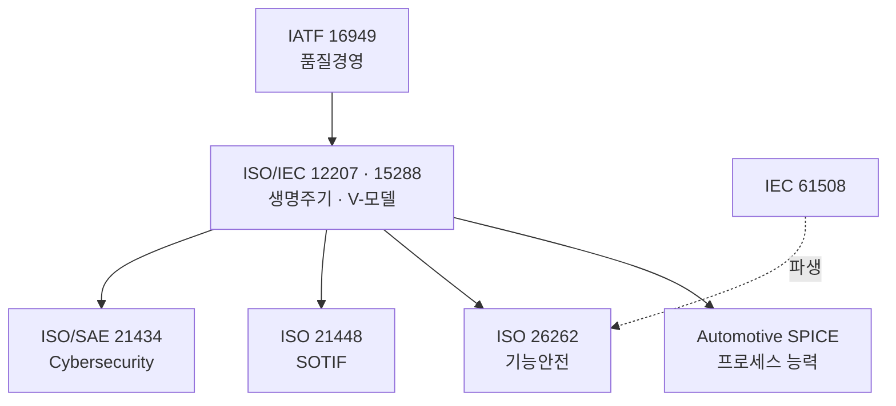
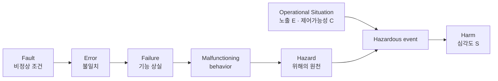
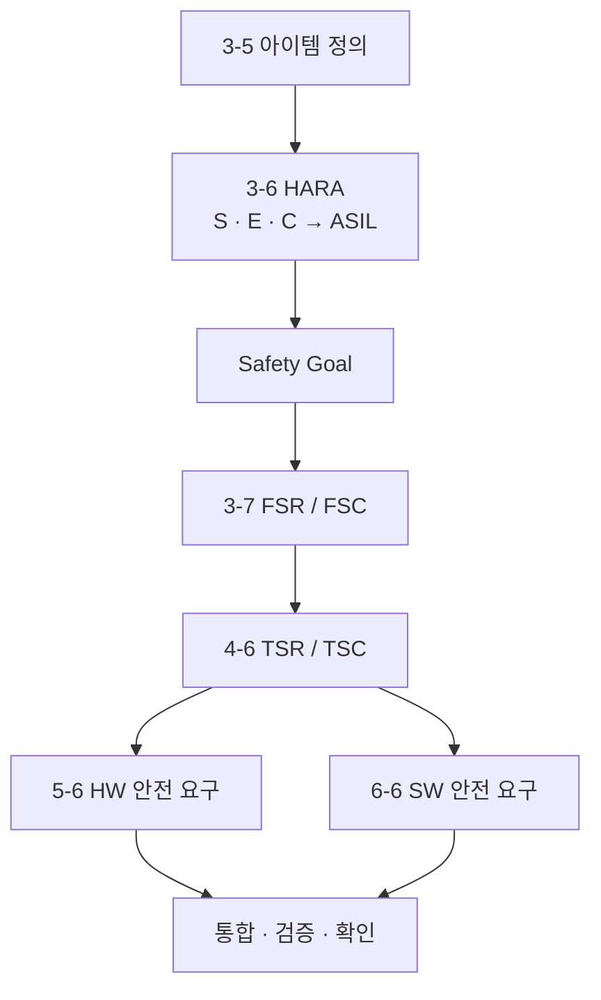
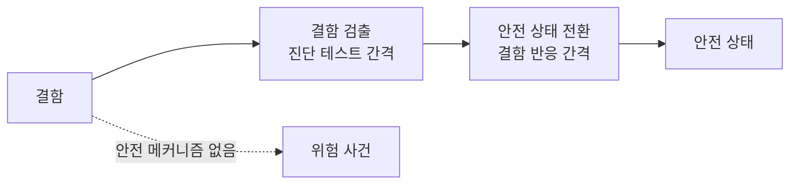
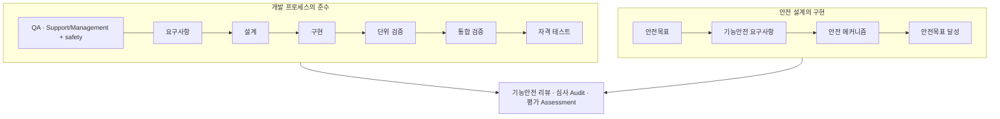
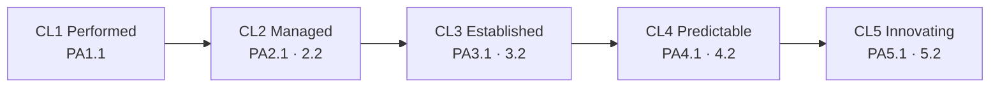
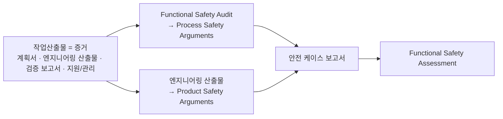

# Mobility Software — Process & Safety Map

프로세스와 기능안전이 어떻게 맞물리는지를 도식으로 정리한다. 아래 그림은 관계를 나타낸 개념도이며 실제 조직도나 문서 개수를 뜻하지 않는다.

[개론](./README.md) · [개발 프로세스 · A-SPICE](./Development_Process_and_ASPICE.md) · [기능안전 · ISO 26262](./Functional_Safety_ISO26262.md)

## 01 · 네 개의 표준, 하나의 프로젝트

| 표준 | 다루는 위험 | 산출하는 등급 |
|---|---|---|
| Automotive SPICE | 개발 프로세스가 통제되지 않을 위험 | Capability Level (CL1–CL5) |
| ISO 26262 | E/E **고장**으로 인한 사고 위험 | ASIL (QM, A–D) |
| ISO 21448 (SOTIF) | 고장 없는 **성능 부족·오용** 위험 | — (시나리오 커버리지) |
| ISO/SAE 21434 | 악의적 **사이버 위협** 위험 | CAL (Cybersecurity Assurance Level) |

## 02 · 고장이 사고가 되는 사슬 (ISO 26262)

네 지점에서 사슬을 끊는다: ① 결함 예방(가이드·프로세스) ② 결함 검출(코드 분석·리뷰·테스트) ③ 결함 허용(이중화·메모리 보호) ④ 차량 레벨 방어(이중 차단·페일세이프). 위험 = f(확률 P, 심각도 S)이며, P는 노출·제어가능성·무결성에 좌우된다.

## 03 · 위험 → 안전 목표 → 계층적 요구사항

| ASIL | 엄격도 | 예 (S / E / C) |
|---|---|---|
| QM | ASIL 아님 | S1 / E1 / C1 |
| A → D | 낮음 → 가장 엄격 | D = S3 / E4 / C3 |

## 04 · 측정에서 안전 상태까지 (FTTI)

`FTTI` = 결함 → 위험 사건(안전 메커니즘 없음). `FHTI` = 결함 검출 간격 + 결함 반응 간격. 비상 운영이 있으면 그 사이에 `EOTI`가 들어간다.

## 05 · V-모델 위에 안전을 얹기

## 06 · A-SPICE 프로세스 ↔ ISO 26262 절

| A-SPICE | ISO 26262:2018 |
|---|---|
| SYS.2 / SYS.3 | 4-6 기술안전 컨셉, 8-6 |
| SYS.4 / SYS.5 | 4-7 시스템·아이템 통합·테스팅 |
| SWE.1 → SWE.6 | 6-6 → 6-11 (SW 안전요구 → 임베디드 SW 테스팅) |
| SUP.1 / SUP.8 / SUP.9 / SUP.10 | 2-5 / 8-7 / 2-6 / 8-8 |
| MAN.3 / PIM.3 | 2-6 / 2-5 |

## 07 · 능력 수준의 계단 (ISO/IEC 33020)

평정 척도 **N / P / L / F**. 아래 단계의 속성이 모두 **F**여야 다음 단계의 대상 속성을 **L/F**로 평가한다.

## 08 · HW 아키텍처 메트릭 목표

| 지표 | ASIL B | ASIL C | ASIL D |
|---|---|---|---|
| SPFM | > 90% | > 97% | > 99% |
| LFM | > 60% | > 80% | > 90% |
| PMHF | < 10⁻⁷/h | < 10⁻⁷/h (100 FIT) | < 10⁻⁸/h (10 FIT) |

고장 유형: **SPF**(메커니즘 없음 → 즉시 오출력) · **RF**(메커니즘이 못 덮은 부분 → 오출력·미검출) · **LF**(숨은 고장, 2차 고장 전까지 정상) · **DPF**(잠재 고장 2개 중첩 → 오출력).

## 09 · 확인 수단 → 안전 케이스

> 모든 도식은 관계를 보이기 위한 개념도다. 프로세스 ID·절 번호·메트릭 목표치는 Automotive SPICE PAM 3.1/4.0, ISO 26262:2018을 인용한 것이며 판과 테일러링에 따라 달라질 수 있다.
