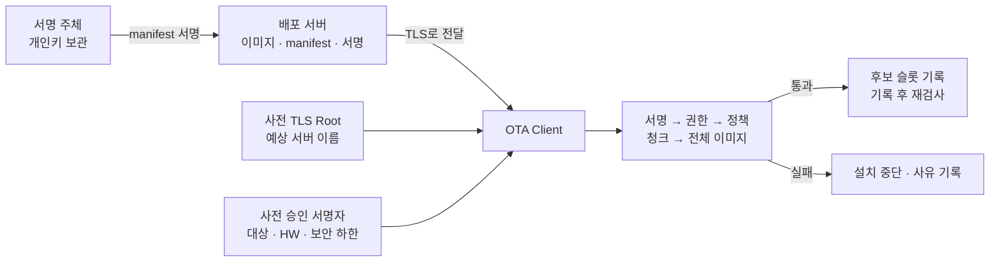
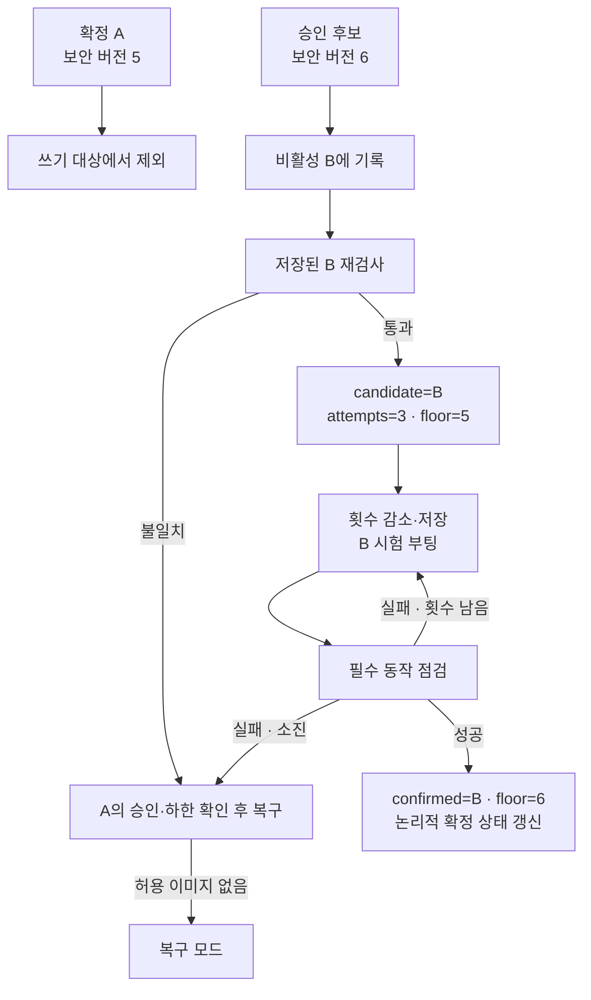
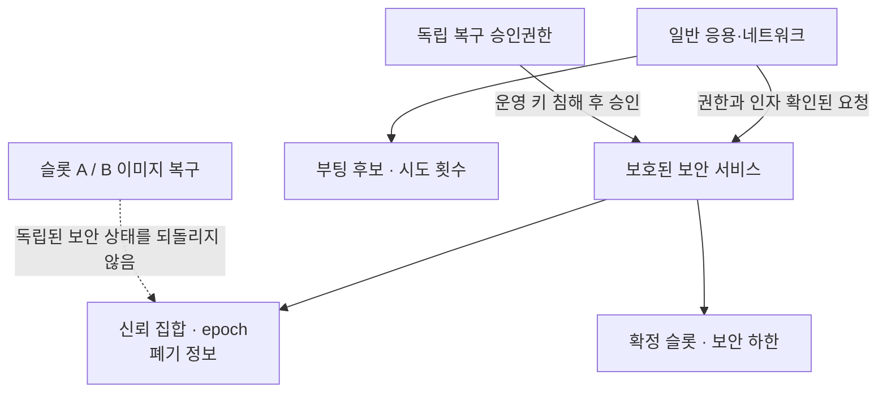
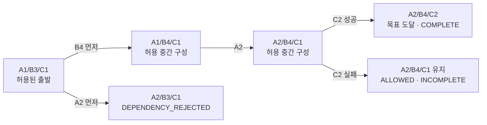

# Secure OTA Visual Overview

[문서 안내](./README.md) · [상세 개념](./Fundamentals.md) · [임베디드 SW 관점](./Embedded_SW_Study.md) · [실습](./lab/README.md)

## 1. 배포물 승인과 연결 상대 인증

TLS 신뢰와 펌웨어 서명 신뢰는 별도다. 단말은 배포물에 동봉된 Root·공개키를 무조건 승인하지 않는다.

## 2. A/B 설치와 실행 상태

시험 중 B가 실행되어도 확정은 A다. floor를 조기에 6으로 높이면 A5 복구가 거부된다.

## 3. 수신 상태와 검증 기준

수신 완료 목록이 인증된 해시를 대신하지 않는다. 모든 청크가 통과한 뒤에도 전체 이미지를 검사한다.

## 4. 보안 상태의 수명

이 구조는 설계 책임을 표시한다. 파일 기반 코드가 실제 하드웨어 보안 경계를 구현한다는 의미는 아니다.

## 5. 다중 ECU 활성화 경로

패키지의 정품 여부, 실제 구성 허용 여부, 캠페인 완료 여부를 각각 기록한다.
