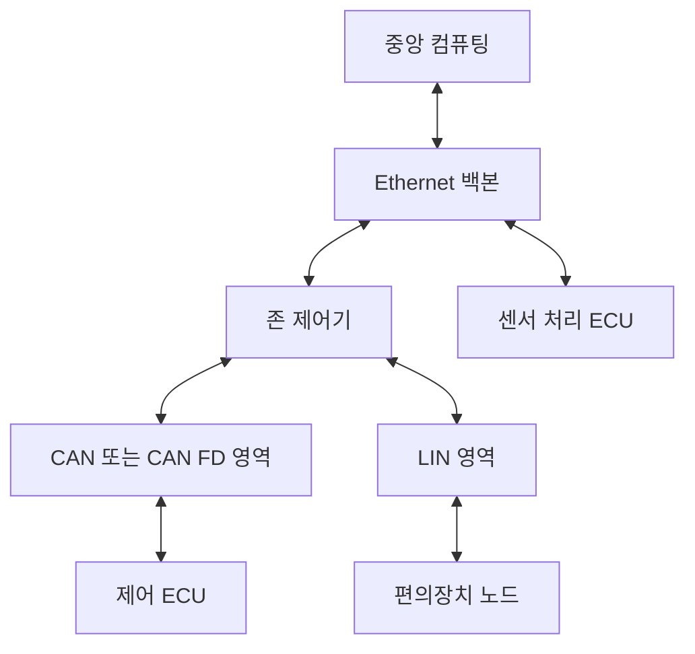
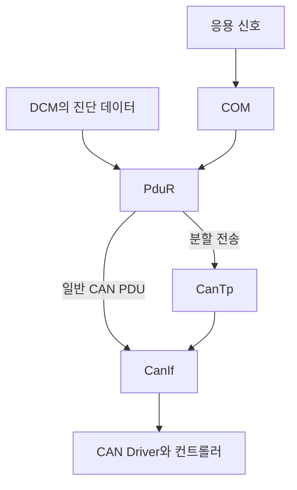
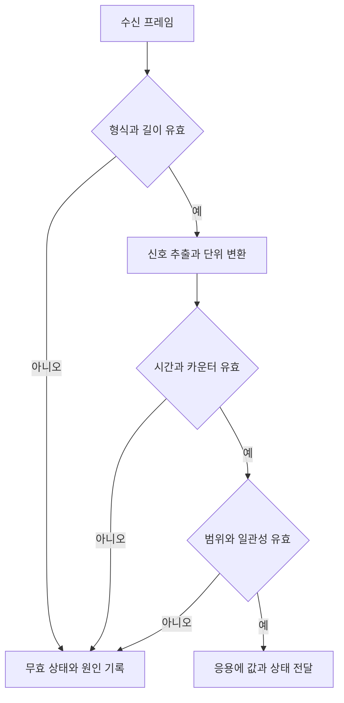

# Vehicle Communication Architecture

네트워크 구성과 데이터 처리 흐름

[문서 안내](./README.md) · [상세 개념](./Fundamentals.md) · [임베디드 SW 구조](./Embedded_SW_Study.md)

아래 도식은 역할을 설명하기 위한 개념도이다. 특정 차량의 배선·ECU 개수·배치나 구현 완료 상태를 뜻하지 않는다.

## 1. 이기종 차량 네트워크

백본은 여러 영역을 연결하고 하위망은 장치의 비용·속도·시간 요구에 맞춰 구성된다. 모든 센서 원시 데이터가 중앙 컴퓨터로 전달되어야 하는 것은 아니며, 로컬 ECU에서 처리한 결과만 공유할 수도 있다.

## 2. 신호 통신과 진단 통신의 합류

AUTOSAR Classic의 대표적인 CAN 송신 경로를 단순화하였다. RTE·E2E·확인 콜백 등의 상세 요소는 생략하였다. COM과 CanTp는 동일한 작업을 하는 모듈이 아니며, 실제 경로는 구성에 따라 달라진다.

## 3. 수신 데이터의 유효성 판단

검사 순서는 데이터 보호 방식에 따라 조정된다. 예를 들어 원시 PDU의 E2E 검사에는 디코딩 전 바이트가 필요할 수 있다. 중요한 것은 값을 전달할 때 유효성과 갱신 시각도 함께 전달하는 것이다.

## 4. 통신 상태와 기능 상태

| 구분 | 확인하는 것 | 성공만으로 보장되지 않는 것 |
|---|---|---|
| 물리 링크 | 신호 또는 링크 연결 | 프레임 형식의 일치 |
| 프레임 | 수신·길이·무결성 | 응용 데이터의 의미 |
| 전송 계층 | 메시지 완결성과 순서 | 진단 서비스의 성공 |
| 서비스 | 요청·응답 관계 | 응용 결과의 물리적 반영 |
| 응용 | 최신값·범위·상태 | 전체 시스템의 모든 정상 조건 |

DoIP 전송 확인과 UDS 긍정 응답, CAN ACK와 제어 기능 완료를 각각 구분하면 로그의 의미를 과대 해석하지 않을 수 있다.

## 5. 시간 예산의 위치

| 구간 | 대표 지연 |
|---|---|
| 송신 응용 | 입력 주기·태스크 대기 |
| 송신 스택 | 패킹·버퍼·스케줄 대기 |
| 네트워크 | 중재·큐·직렬화·전파 |
| 게이트웨이 | 매핑·목적지 대기 |
| 수신 스택 | 재조립·검사·디코딩 |
| 수신 응용 | 다음 실행 주기까지 대기 |

각 구간의 시간은 같은 타임스탬프 기준에서 비교해야 한다. 서로 동기화되지 않은 두 로그의 차이를 그대로 네트워크 지연으로 계산하지 않는다.
